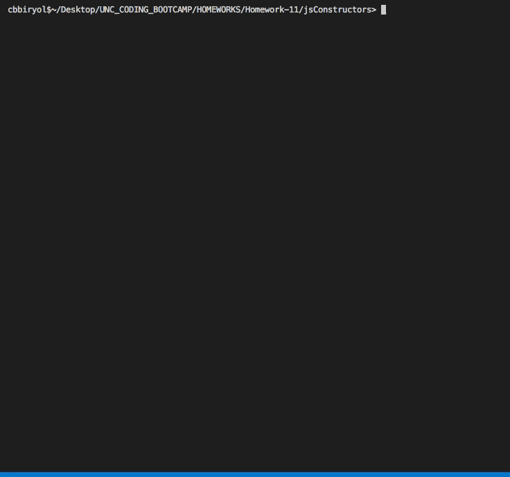

# Game of Thrones Command Line Hangman

## Summary

This is a commandline based game that prompts user to guess letters in a randomly chosen "Game of Thrones" related word. 

In oreder to run the game you need the ```inquirer``` npm package. This dependecy is given in the package.json so the user only needs to run the following command in command line
``` javascript
npm install 
``` 
In addition to ```inquirer``` the game aslo uses ```colors``` npm package for colorizing the ```console.log()``` outputs.

In order to run the game:

```
node index.js
```

--- 


---
## Specifications

The game is composed of three functions and two basic constructors.

**The functions are:**
* ``` initGame()``` : handles reseting of game and selection of random word between rounds and at the beginning.
* ``` play_game()```: this is where the outcome of the current state of the game is determined.
* ``` letterInqr()```: reqursively called to prompt user to guess a letter and display the outcome.

**The constructors are:**

* `Word.js` : required by `index.js` and parses a word into array of letter constructors. Compares each constructor against the guessed letter and concatinates the returned string array from Letter.js. This string is then returned to index.js to be displayed.
* `Letter.js`: required by `Word.js` and handles if a letter is guessed or not and returns either the correctly guessed letter or the letter place holder ( ` _ ` ).

The index.js main functionality is provided by the ``` game ``` object which holds the current state of the guessed word, the score, guesses left and the letters that has already been guessed. The ```validate``` functionality of inquirer is used to validate the user input and to make sure the input letter has not been entered previously within the same game. The ```validate``` functionality also makes sure the user enters a alphabetic character.  


